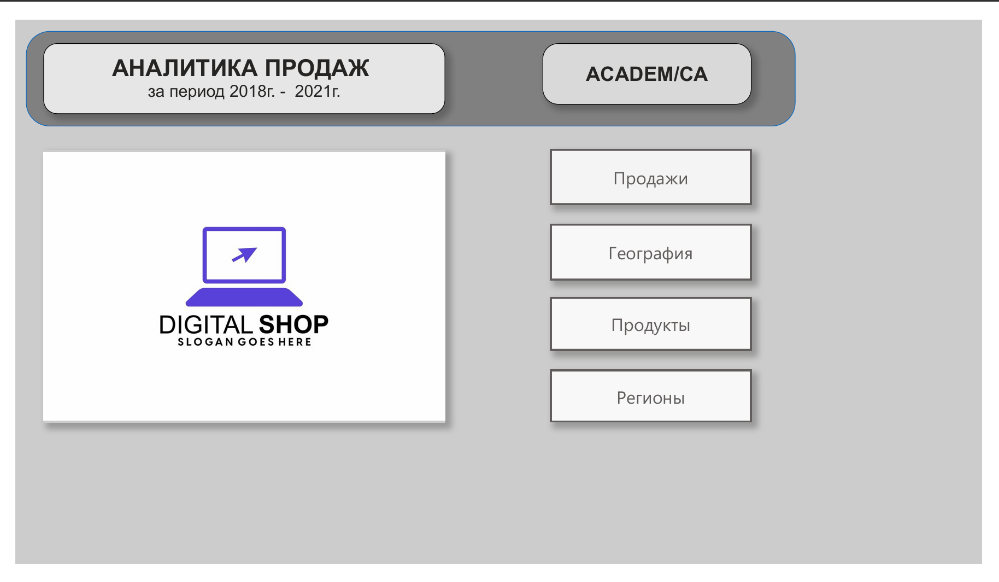
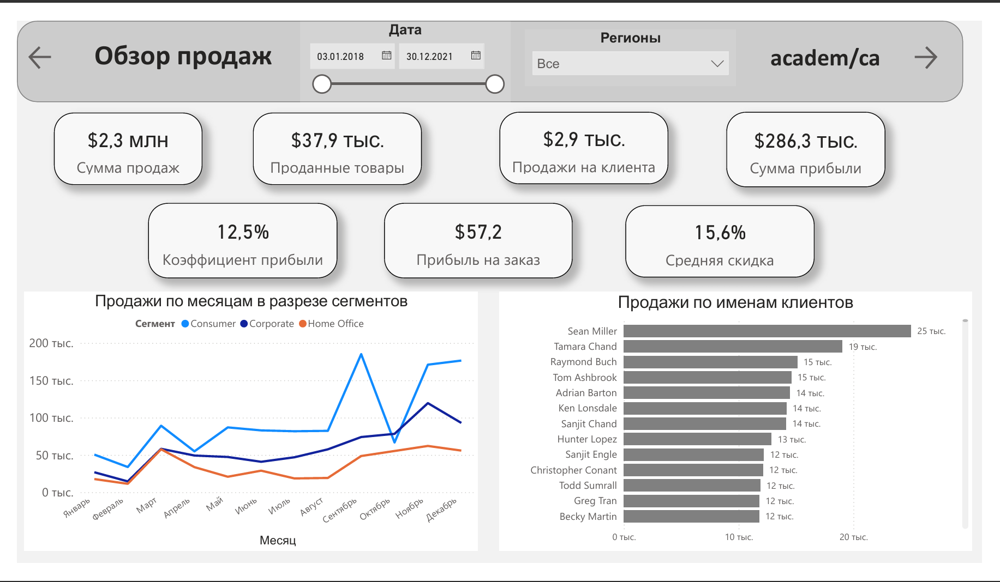
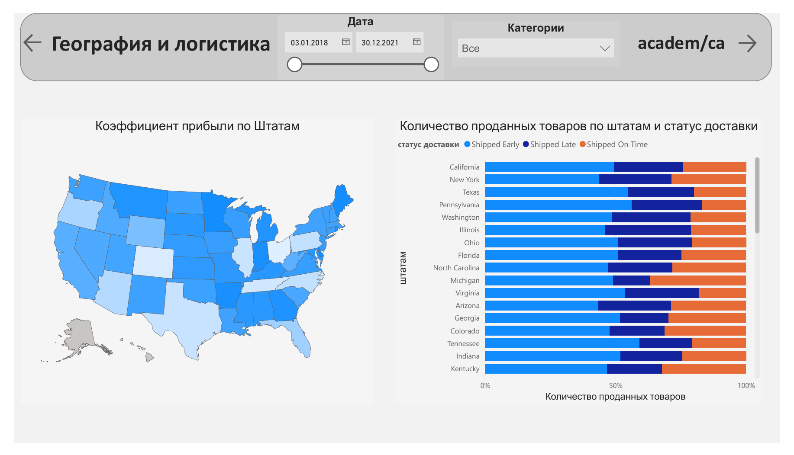
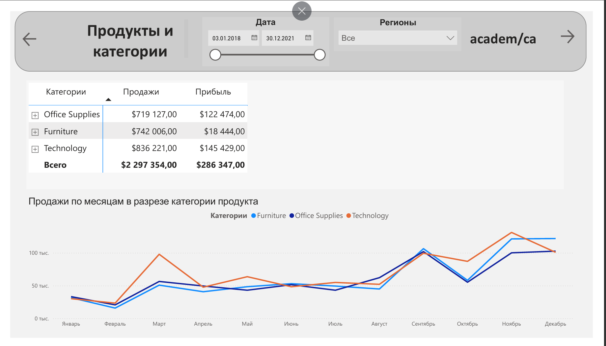
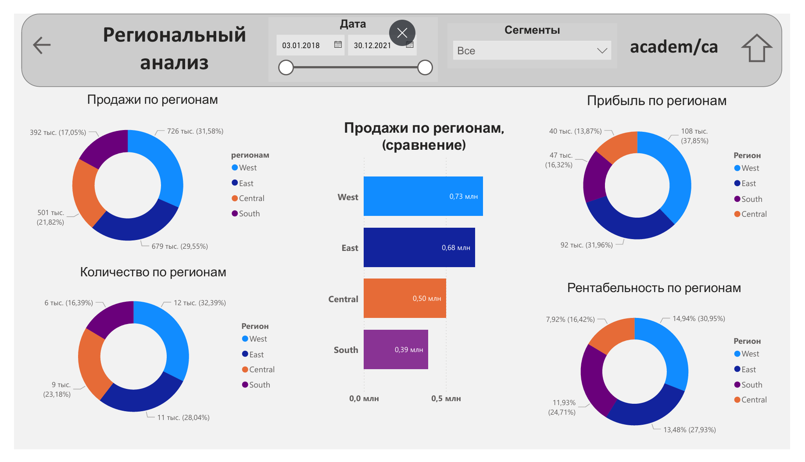

Проект: Комплексный анализ продаж (2018-2021)

Интерактивный дашборд в Power BI для анализа эффективности продаж, логистики и продуктового портфеля компании.
Проект состоит из Главного меню и четырех детализированных страниц.

Главное меню
Обеспечивает удобную навигацию между всеми разделами отчета с помощью интерактивных кнопок.

---
### 1. Обзор продаж
Верхнеуровневый анализ ключевых KPI.
* **Показатели:** Сумма продаж, Количество, Прибыль, Маржинальность, Средний чек и Скидка.
* **Визуализация:** Динамика продаж по месяцам в разрезе сегментов и Рейтинг клиентов по выручке.

---
### 2. География и логистика
Анализ региональной эффективности и качества доставки.
* **Карта:** Визуализация коэффициента прибыли по штатам (США).
* **Логистика:** Анализ количества проданных товаров в разрезе штатов и статусов доставки (Early, Late, On Time).

---
### 3. Продукты и категории
Детальный разбор продуктового ассортимента.
* **Иерархия:** Сводная таблица с возможностью дрила (бурения) от Категории до конкретного Товара.
* **Тренд:** Сравнение динамики продаж по основным категориям товаров (Furniture, Office Supplies, Technology).

---
### 4. Региональный анализ
Сравнительный анализ эффективности подразделений.
* **Круговые диаграммы:** Структура Продаж, Прибыли и Количества по регионам (West, East, Central, South).
* **Сравнение:** Гистограмма для наглядного сравнения выручки между регионами.

